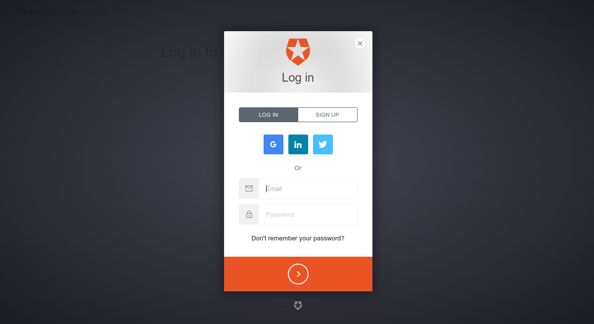

# Build a React + Flux App with User Authentication

Learn how to build a real-world React app that calls a remote API and authenticates users

## Link to Tutorial

[https://scotch.io](https://scotch.io/tutorials/build-a-react-flux-app-with-user-authentication)
