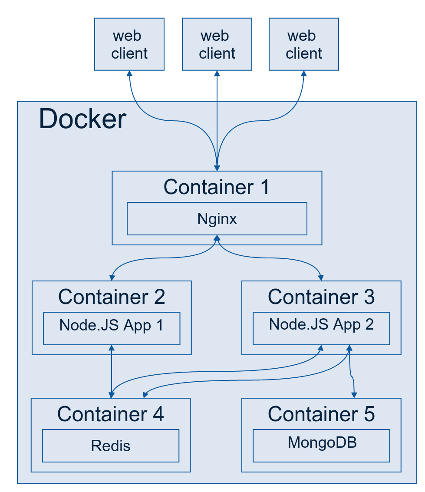

# DevOps
Simple example DevOps

## Architecture



## Docker RUN

```bash
# Run Redis container
docker run -d --name redis -p 6379:6379 redis

# Node build Image and create container
docker build -t batazor/node .
docker run -d --name node -p 8080 --link redis:redis batazor/node

# Nginx build Image and create container
docker build -t batazor/nginx .
docker run -d --name nginx -p 80:80 --link node:node batazor/nginx
```
