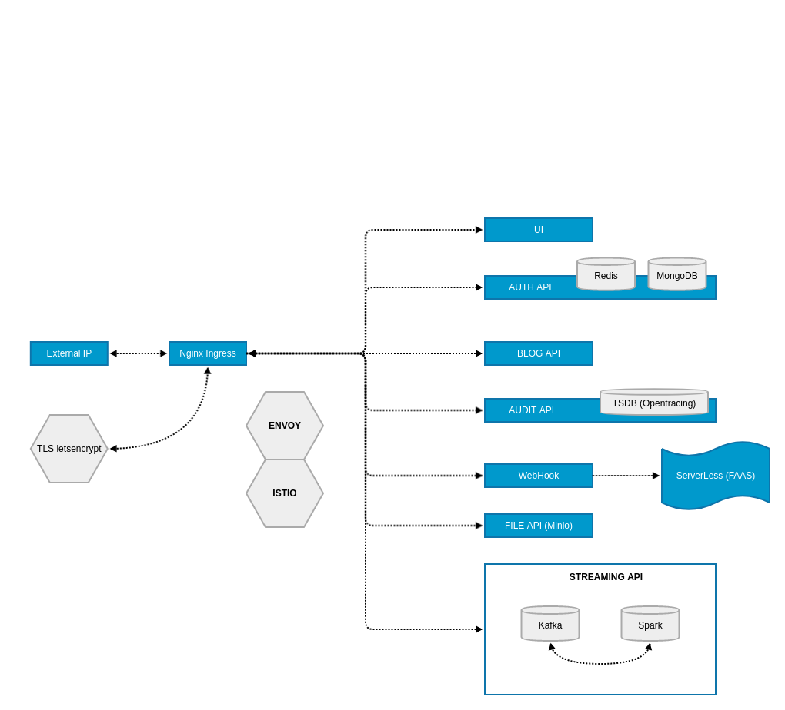

# architecture
General description of the architecture

### Detail architecture

##### [Workflow](./Workflow.md)
Describes tools for work with worklow.

##### [Documentation](./Documentation.md)
Describes tools for work with documentation.

##### [Logging](./Logging.md)
Describes tools for work with logging.

##### [Service](./Service.md)
Describes tools for work with services.

##### [NodeJS](./NodeJS.md)
Describes tools for work with the NodeJS and the JS

##### [Android](./Android.md)
Describes tools for work with the Android platform
